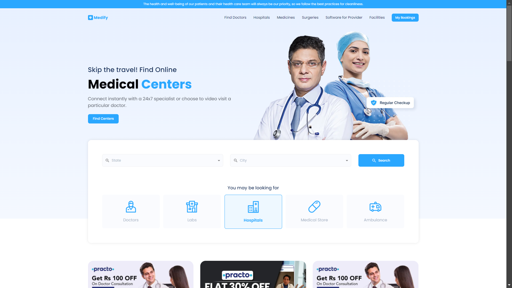
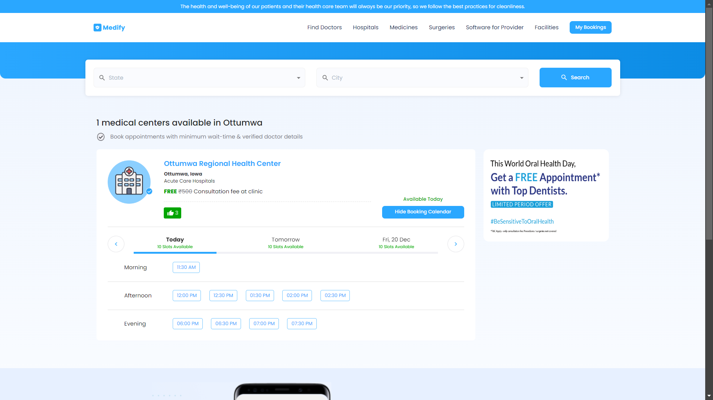
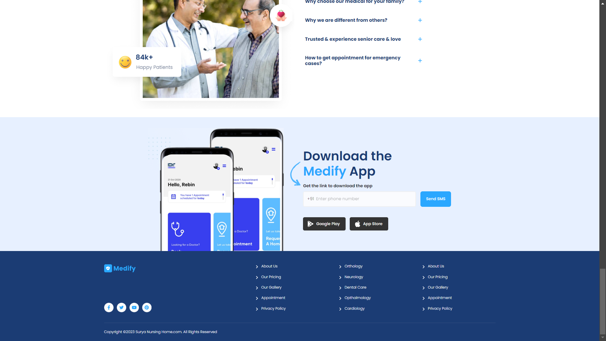

# 🏥 MEDIFY - Medical Center Slot Booking Platform

## ✨ Overview

**MEDIFY** is a React-based web application designed to help users find medical centers in specific states and cities across the USA. The platform allows users to search for available medical centers, book appointments, and manage their bookings. 

## 📸 Project Screenshot

Here is a screenshot of the app:

The project includes the following key features:

- **Search for Medical Centers**: Users can select a state and city to view medical centers available in that area.
- **Booking Interface**: Allows users to select a medical center, pick a date, and choose a time slot for appointments.
- **My Bookings**: Users can view and manage their upcoming appointments.
- **Fully Responsive Design**: Ensures the application works across devices.
- **Carousels**: Implemented with Swiper for featured content and offers.

---

## 🛠️ Features

### 1. Landing Page
- Top navigation bar with links to **Find Doctors**, **Hospitals**, **Medicines**, etc.
- **State and City** dropdowns populated from the backend API.
- Sections for medical center search and more as per the Figma design.

### 2. Search Results Page
- Displays a list of available medical centers in the selected state and city.
- Option to view details and book an appointment.

### 3. Booking Interface
- Users can choose a medical center and view a calendar-like interface to select a date.
- The app allows booking appointments up to one week in advance.
- Users can select a time slot for their chosen date.

### 4. My Bookings Page
- Personalized page displaying all the user’s bookings.
- Details such as the **hospital name**, **appointment date**, and **time** are shown.

### 5. Responsive Design
- Ensures the platform is mobile-friendly and adapts to various screen sizes.

---

## 📡 Backend Endpoints

The backend API provides the data needed for various operations, including retrieving lists of states, cities, and medical centers. Here are the relevant endpoints:

- **Get all states**:  
  `GET https://meddata-backend.onrender.com/states`
  
- **Get cities in a particular state**:  
  `GET https://meddata-backend.onrender.com/cities/:state`  
  Example: `GET https://meddata-backend.onrender.com/cities/Alaska`

- **Get medical centers in a city**:  
  `GET https://meddata-backend.onrender.com/data?state=<state-name>&city=<city-name>`  
  Example: `GET https://meddata-backend.onrender.com/data?state=Alaska&city=SOLDOTNA`

---

## 🛠️ Technologies Used

- **React.js**: For building the user interface.
- **Material-UI**: For UI components and styling.
- **Swiper**: For implementing carousels.
- **Axios**: For making HTTP requests.
- **Node.js**: For backend API handling.

## 📡 Deployed on Vercel

You can view the live project here: [**MEDIFY - Live Demo**](https://your-vercel-link.vercel.app)

